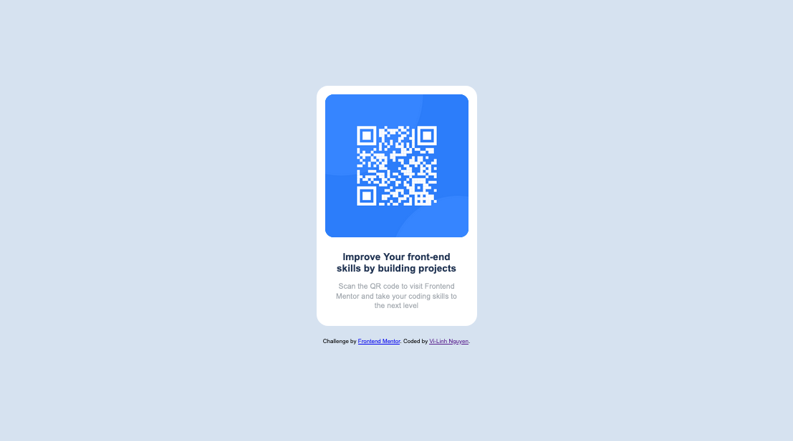

# Frontend Mentor - QR code component solution

This is a solution to the [QR code component challenge on Frontend Mentor](https://www.frontendmentor.io/challenges/qr-code-component-iux_sIO_H). Frontend Mentor challenges help you improve your coding skills by building realistic projects.

## Table of contents

- [Overview](#overview)
  - [Screenshot](#screenshot)
- [My process](#my-process)
  - [Built with](#built-with)
  - [What I learned](#what-i-learned)
  - [Continued development](#continued-development)
  - [Useful resources](#useful-resources)
- [Author](#author)

**Note: Delete this note and update the table of contents based on what sections you keep.**

## Overview

This is my attempt at the qr code component challenge on freecodementor.io. I don't have a pro account so I did not have access to the figma files, which means the pixel sizing is guesswork.

### Screenshot



Above is the result of my attempt of this challenge in desktop mode.


## My process

### Built with

- Semantic HTML5 markup
- CSS custom properties
- Flexbox

### What I learned

I initially tried to recreate each part of the given qr code image separately. That's why there's a clip-path
implemented in one of the css custom codes (seen below). I didn't look through the project enough, and finally saw that there was an image with the qr code provided. But I left the clip-path in there anyway as
reference in case I needed it for a future project.

```html
<h1>Some HTML code I'm proud of</h1>
```

```css
.card-image,
.qrcode {
  background-color: hsl(211, 92%, 54%);
  width: 25rem;
  height: 25rem;
  border-radius: 1.5rem;
  clip-path: polygon(0% 0%, 100% 0%, 100% 100%, 0% 100%);
}
```

### Continued development

I'd have to look more into margins and how to place components on a page. Centering the card on the page makes this challenge tedious. Plus the size of the card was guesswork wihthout the figma files.

### Useful resources

- [flexbox help](https://the-echoplex.net/flexyboxes/?fixed-height=on&display=flex&flex-direction=column&flex-wrap=wrap&justify-content=center&align-items=center&align-content=stretch&order%5B%5D=0&flex-grow%5B%5D=0&flex-shrink%5B%5D=1&flex-basis%5B%5D=auto&align-self%5B%5D=auto&order%5B%5D=0&flex-grow%5B%5D=0&flex-shrink%5B%5D=1&flex-basis%5B%5D=auto&align-self%5B%5D=auto&order%5B%5D=0&flex-grow%5B%5D=0&flex-shrink%5B%5D=1&flex-basis%5B%5D=auto&align-self%5B%5D=auto) - This helps demo different flexbox settings.
- [add images to markdown](https://stackoverflow.com/questions/14494747/how-to-add-images-to-readme-md-on-github) - I didn't know how to add images to markdown. I needed this for adding screenshots to the readme.md here.
- [clip-path css reference](https://developer.mozilla.org/en-US/docs/Web/CSS/clip-path) - Before I realized the qr code was an image, I tried making the backdrop using this. -[color picekr](https://htmlcolorcodes.com/color-picker/) - Always useful to pick specific colors.

**Note: Delete this note and replace the list above with resources that helped you during the challenge. These could come in handy for anyone viewing your solution or for yourself when you look back on this project in the future.**

## Author

- Website - [Vi-Linh Nguyen](https://vilinh27.github.io)
- Frontend Mentor - [@ViLinh27](https://www.frontendmentor.io/profile/ViLinh27)
- Twitter - [@vilinh27](https://twitter.com/vilinh27)
